# HR Assistant Application Readme

The HR Assistant application is a web-based tool designed to streamline the recruitment process for HR recruiters and applicants. This readme file provides instructions on how to deploy and utilize the HR Assistant application effectively.

## Table of Contents

1. [Application Deployment](#application-deployment)
2. [HR Recruiter's Workflow](#hr-recruiters-workflow)
3. [Applicant's Workflow](#applicants-workflow)

## 1. Application Deployment

To deploy the HR Assistant application, please follow the steps outlined below:

### 1.1 Set up the Environment

1. Ensure that the required software tools and libraries, as described in **Chapter 4** of the documentation, are installed on the deployment server or hosting environment. Specifically, make sure that **Python 3.9** is installed, in addition to installing **Tesseract-OCR**.

2. Open PowerShell and execute the following commands:

   ```powershell
   py -3 -m venv venv
   venv/Scripts/Activate
   pip install -r requirements.txt
   ```

### 1.2 Database Configuration

1. Configure the MySQL database by setting up the necessary tables and establishing the required connections. Ensure that the database credentials and connection details are properly configured within the application.

2. Create a new database with the name **hrassistant**.

3. Import the file **DatabaseCreation.sql** into the database to set up the required tables.

### 1.3 Web Application Setup

1. Deploy the HR Assistant web application to a web server or hosting environment.

2. Ensure that the web application is accessible via a web browser using the URL **http://127.0.0.1:5000**.

3. Open PowerShell and execute the following command to start the web application:

   ```powershell
   flask --app app --debug run
   ```

## 2. HR Recruiter's Workflow

HR recruiters can follow these steps to effectively use the HR Assistant application:

### 2.1 Log in to the Application

1. Access the HR Assistant web application using the provided credentials for HR recruiters.

   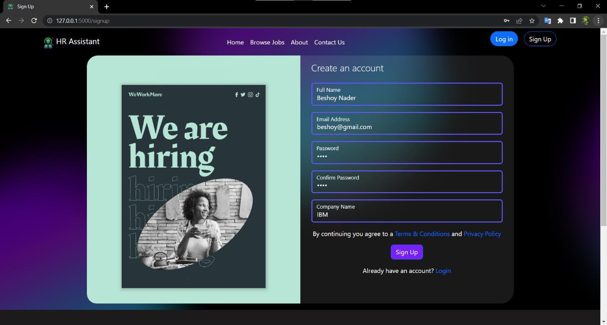
   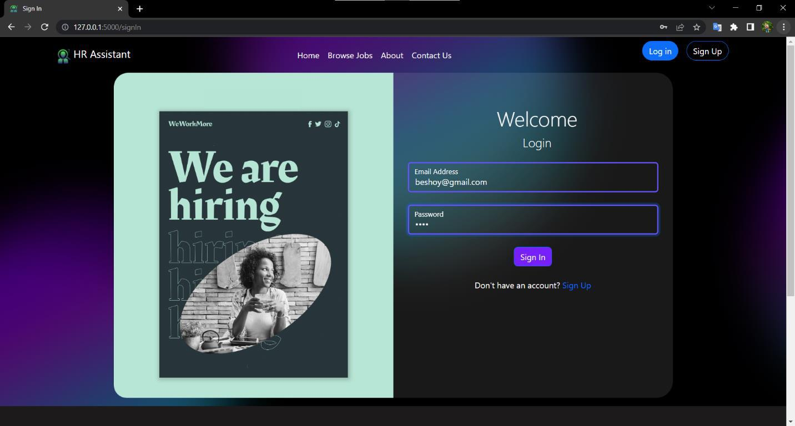
   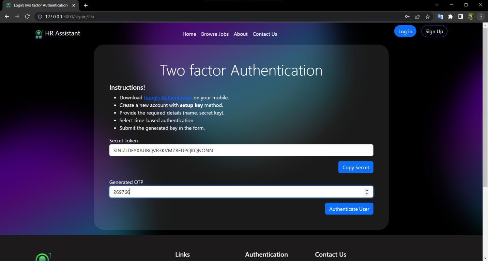

### 2.2 Advertise Job Opportunities

1. Use the interface to create and advertise new job opportunities.

2. Provide detailed job descriptions, including required skills and qualifications, to attract suitable candidates.

   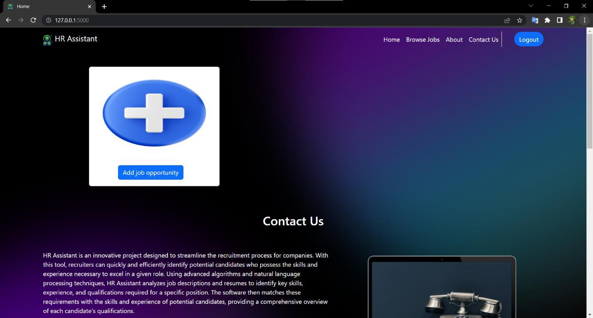
   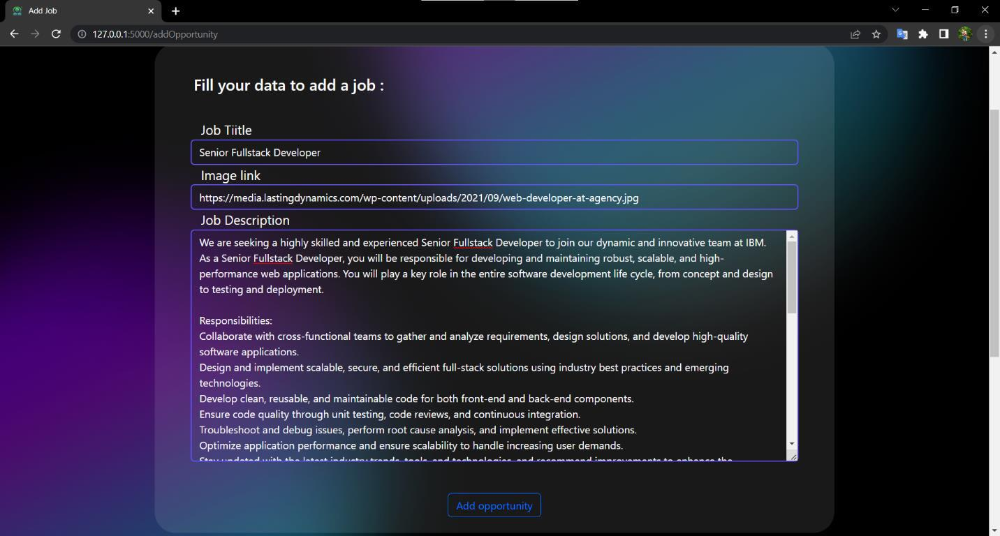

### 2.3 Receive Resumes

1. Monitor the application for incoming resumes from applicants.

2. The system will rearrange the resumes based on their similarity to the job description when you press the "Process" button, making it easier to identify potential candidates.

   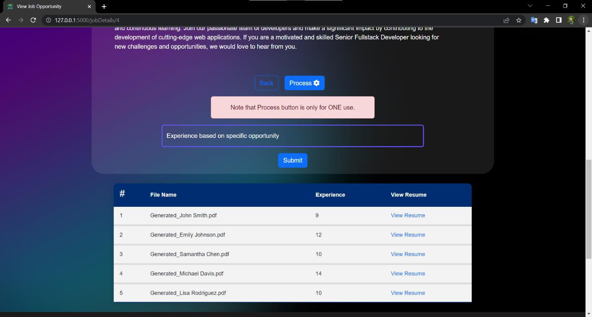
   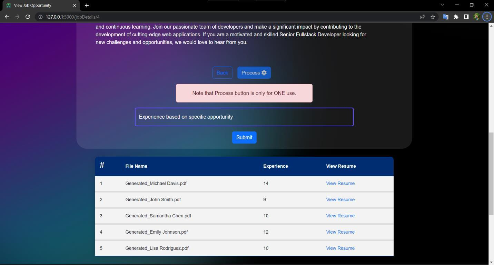

### 2.4 Review Resumes

1. Evaluate the rearranged resumes and assess the suitability of candidates based on their skills, experience, and qualifications.

   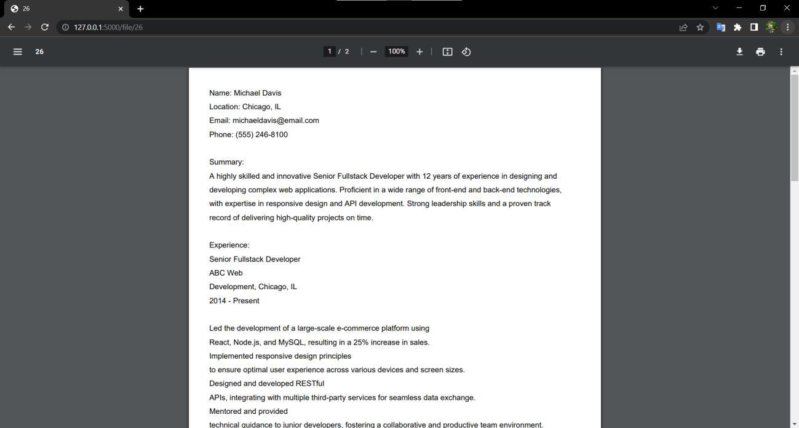

### 2.5 Shortlist and Contact Candidates

1. Select the most suitable candidates from the rearranged resumes.

2. Proceed with further steps in the recruitment process, such as conducting interviews or contacting candidates for further discussions.

   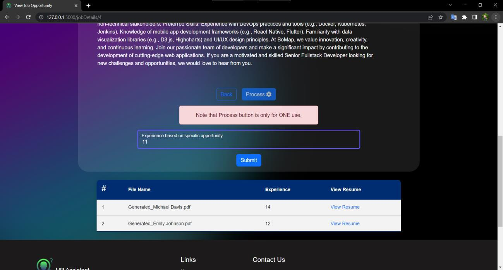

## 3. Applicant's Workflow

Applicants can follow these steps to utilize the HR Assistant application effectively:

### 3.1 Review Job Opportunities

1. Explore the advertised job opportunities on the platform.

2. Read the job descriptions and requirements carefully to understand the expectations and qualifications.

   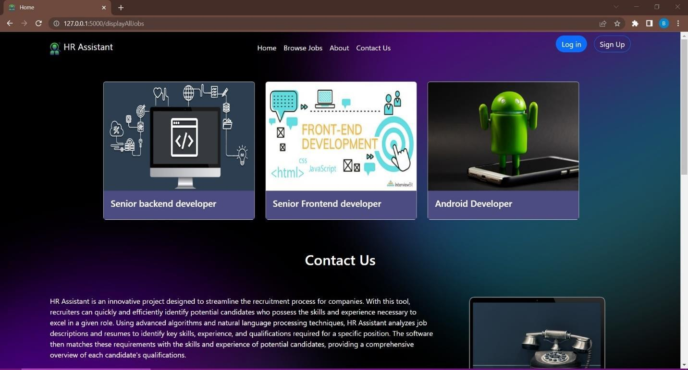
   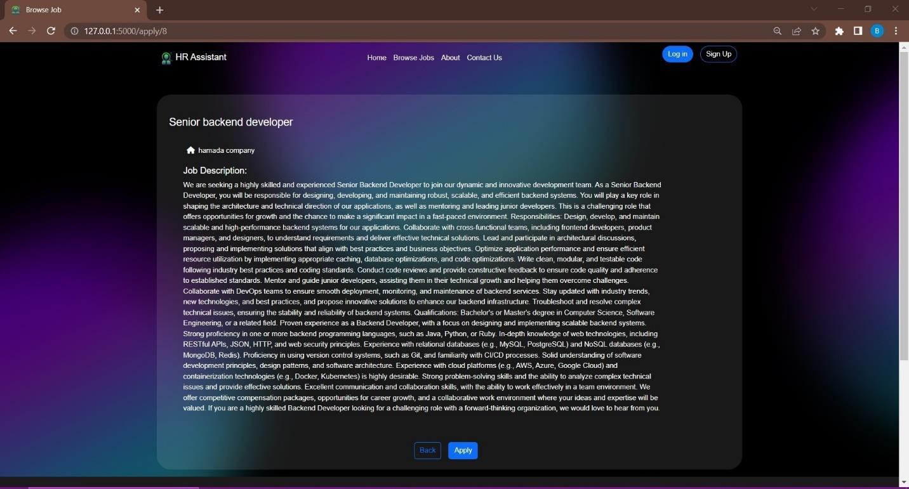

### 3.2 Upload Resume

1. Use the provided interface to upload your resume.

2. Ensure that the resume is in an acceptable format, such as PDF, for accurate processing.

   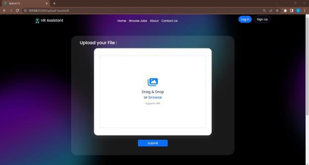

### 3.3 Submit Application

1. Select the desired job opportunity.

2. Submit your resume for consideration.

3. The HR Assistant system will automatically analyze your resume and compare it with the job description to determine its suitability.

Thank you for using the HR Assistant application. If you have any questions or encounter any issues, please refer to the documentation or contact the support team for assistance.
